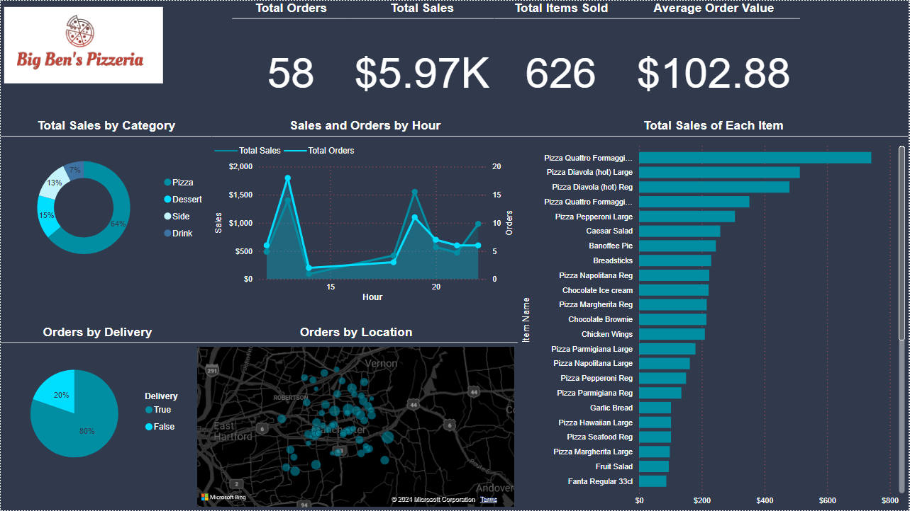

# Pizza-Shop-Project
The project involves creating a tailor-made relational database for a new pizzeria. The project utilizes tools such as Quick Database Diagrams for database design and SQL for creating and managing the database. Additionally, PowerBI is integrated with the MySQL database to create interactive dashboards.

## Situation
A new pizza shop called Ben's Pizzeria is being opened, focusing on take-out and delivery services. A project brief is provided to design and build a tailor-made relational database for the business, which will capture and store essential information related to customer orders, stock levels, and staff management. The database will enable the owner to monitor business performance and will be used to create interactive dashboards for this purpose.

## Normalization
The project used normalization techniques to improve data integrity and minimize data repetition. This involved creating mock-ups of tables and organizing the data systematically before importing it into the database.

## Database Design
The project uses QuickDBD, a database design tool, to create a visual representation of the database schema. QuickDBD allows the user to specify tables and their fields and then produces a diagram of the database and its tables.

